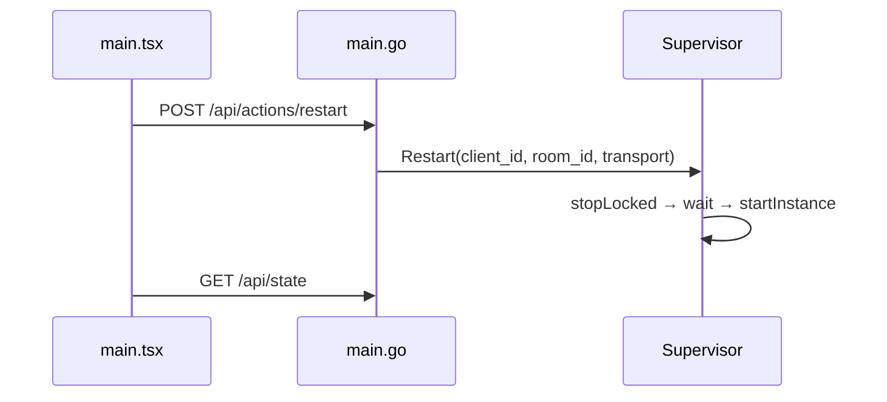
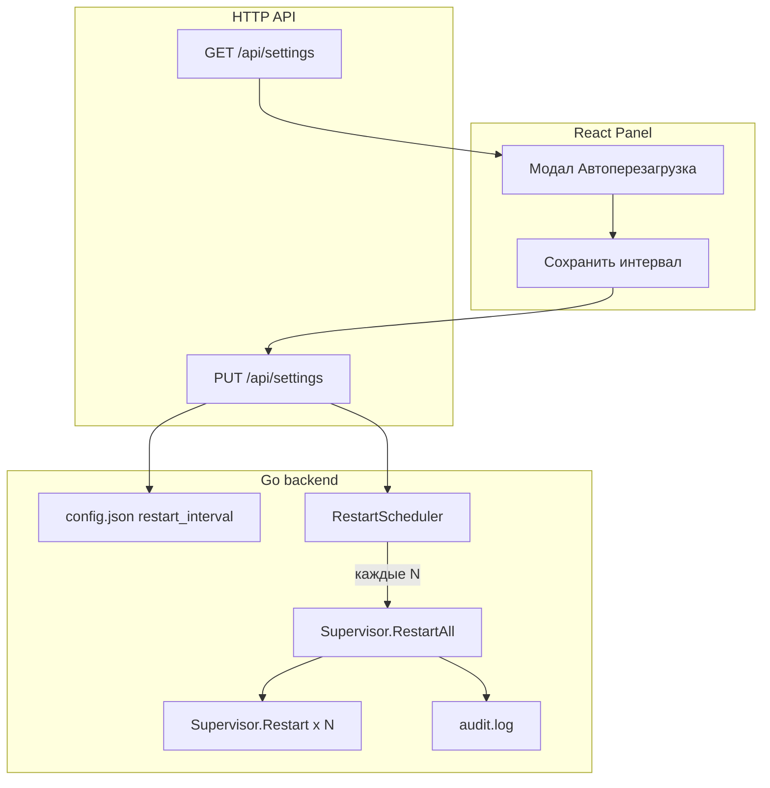

# План: автоперезагрузка всех инстансов по интервалу

## Текущее состояние

Ручная перезагрузка **одной локации** уже работает end-to-end:



| Слой | Файл | Что есть |
|------|------|----------|
| UI-кнопка | [`src/main.tsx`](src/main.tsx) ~1726–1733 | `restartLocation()` → `POST /api/actions/restart` |
| API | [`cmd/olcrtc-manager/main.go`](cmd/olcrtc-manager/main.go) ~429–445 | Handler вызывает `Supervisor.Restart` |
| Логика | [`cmd/olcrtc-manager/main.go`](cmd/olcrtc-manager/main.go) ~845–890 | Stop + wait + start одного инстанса |
| Таймеры | [`cmd/olcrtc-manager/main.go`](cmd/olcrtc-manager/main.go) ~2214–2227 | Только `QuotaEnforcer` (30s), не restart |

**Чего нет:** `RestartAll`, планировщика, поля в конфиге, UI для интервала, статуса «следующая перезагрузка».

---

## Целевое поведение (по вашим ответам)

- **Интервал:** относительный, в формате `5s` / `10m` / `6h` / `1d` (как `refresh`)
- **Режим:** повторяющийся — каждые N времени перезапускаются **все активные** инстансы (с учётом квот, через `activeLocations`)
- **Пустое значение** = автоперезагрузка отключена
- **После сохранения** таймер сбрасывается; первый цикл — через полный интервал

---

## Архитектура решения



**Эталон для планировщика:** [`QuotaEnforcer.Run`](cmd/olcrtc-manager/main.go) — отдельная goroutine с `time.Timer`, запускается в `run()` рядом с quota enforcer.

---

## Backend: изменения в [`cmd/olcrtc-manager/main.go`](cmd/olcrtc-manager/main.go)

### 1. Поле конфигурации

Добавить в `Config`:

```go
RestartInterval string `json:"restart_interval,omitempty"`
```

Обновить:
- `MarshalJSON` / `UnmarshalJSON` (через существующий wrapper)
- `Normalize()` — `strings.TrimSpace`
- `Validate()` — переиспользовать `validateRefresh()` (уже валидирует `5s`, `10m`, `6h`, `1d`; пустая строка = OK)

### 2. `Supervisor.RestartAll`

Новый метод (~рядом с `Restart`):

```go
func (s *Supervisor) RestartAll(ctx context.Context, now time.Time) error
```

Логика:
1. Взять `activeLocations(s.cfg, now)` — те же локации, что стартуют при boot
2. Отсортировать по `locationKey` для детерминированного порядка
3. Для каждой локации вызвать существующий `Restart(ctx, clientID, roomID, transport)`
4. Собрать ошибки через `errors.Join` (частичный сбой одной локации не блокирует остальные)
5. Записать audit: `appendAudit(configPath, "instances_restarted", "scheduled, interval=30m, count=N")`

Переиспользует всю существующую логику stop/wait/start/quota/monitor — без дублирования.

### 3. `RestartScheduler`

Новая структура (по образцу `QuotaEnforcer`):

```go
type RestartScheduler struct {
    configPath string
    supervisor *Supervisor
    mu         sync.Mutex
    interval   time.Duration  // 0 = disabled
    nextAt     time.Time
}
```

Методы:
- `NewRestartScheduler(configPath, supervisor)` — читает интервал из конфига
- `Run(ctx)` — цикл `select { ctx.Done / timer.C }`:
  - при срабатывании: `RestartAll` → пересчитать `nextAt` → `timer.Reset(interval)`
  - при `interval == 0`: ждать без таймера (или длинный sleep + проверка)
- `UpdateFromConfig(cfg Config)` — вызывается из `settingsHandler` после `PUT /api/settings`:
  - парсит `restart_interval` → `time.Duration` (через helper на базе `validateRefresh` + множители s/m/h/d)
  - сбрасывает `nextAt = now + interval`
  - сбрасывает таймер

Запуск в `run()` (~строка 323):

```go
restartScheduler := NewRestartScheduler(configPath, supervisor)
go restartScheduler.Run(ctx)
```

### 4. Расширение API настроек

В [`settingsResponse`](cmd/olcrtc-manager/main.go) и [`updateSettingsRequest`](cmd/olcrtc-manager/main.go):

```go
RestartInterval   string `json:"restart_interval,omitempty"`
RestartEnabled    bool   `json:"restart_enabled"`      // interval != ""
NextRestartAt     string `json:"next_restart_at,omitempty"` // RFC3339, для UI
```

В `updateSettings()`:
- записать `cfg.RestartInterval`
- валидировать через `validateRefresh`
- `saveConfig` + `appendAudit(..., "restart_interval_updated", ...)`

В `settingsHandler` `PUT`:
- после `supervisor.UpdateSettings(cfg)` вызвать `restartScheduler.UpdateFromConfig(cfg)`

В `Supervisor.UpdateSettings` (~741):
- добавить `s.cfg.RestartInterval = cfg.RestartInterval`

### 5. Helper: `refreshToDuration`

Преобразование `30m` → `30 * time.Minute`. Можно вынести рядом с `validateRefresh`, переиспользовать правила парсинга.

**Рекомендация:** добавить минимальный порог (например `5m`) только для `restart_interval`, чтобы случайно не поставить `5s` и не устроить шторм перезагрузок. Отдельная `validateRestartInterval` с `min >= 5m` или переиспользовать `validateRefresh` без ограничения — на усмотрение при реализации.

---

## Frontend: изменения в [`src/main.tsx`](src/main.tsx)

### 1. Типы и форма

Расширить `SettingsState`, `SettingsForm`, `defaultSettingsForm`:

```ts
restart_interval?: string;
restart_enabled?: boolean;
next_restart_at?: string;
```

### 2. Новое меню в шапке

Кнопка рядом с «Настройки» (~1567):

```
[Автоперезагрузка]  — иконка RefreshCw + Clock (lucide-react)
```

State: `showRestartSchedule` (boolean).

### 3. Модальное окно «Автоперезагрузка инстансов»

По образцу существующего `Modal` (~427) и секций в `showSettings` (~1914):

| Элемент | Описание |
|---------|----------|
| Поле ввода | `restart_interval`, placeholder `например 6h` |
| Подсказка | Формат `5s`, `10m`, `6h`, `1d`; пусто = выкл |
| Статус | Если `restart_enabled`: «Следующая перезагрузка: {formatted next_restart_at}» |
| Кнопки | «Сохранить», «Отключить» (очистить интервал), «Закрыть» |

### 4. Обработчики

- `loadSettings()` (~1220) — заполнять `restart_interval` в форму
- `saveRestartSchedule()` — `PUT /api/settings` с текущими полями settings + новый `restart_interval` (аналог `saveSettings` ~1456, можно вынести общий payload-builder)
- `disableRestartSchedule()` — `PUT` с `restart_interval: ""`
- Использовать `runAction` для единообразной обратной связи и refresh state/metrics/audit

### 5. Отображение статуса

- В модале — `next_restart_at` из API
- Опционально: бейдж в шапке «Авто: 6h» когда включено (через `settings.restart_enabled`)

Переиспользовать `cleanRefresh()` (~313) для очистки пустых значений.

---

## Тесты: [`cmd/olcrtc-manager/main_test.go`](cmd/olcrtc-manager/main_test.go)

| Тест | Что проверяет |
|------|---------------|
| `TestConfigValidatesRestartInterval` | Валидация `30m`, отклонение `10w`, пустая строка OK |
| `TestUpdateSettingsRestartInterval` | Round-trip через `updateSettings` + `saveConfig` |
| `TestRestartSchedulerTriggersRestartAll` | Mock/stub supervisor; scheduler с коротким интервалом вызывает restart |
| `TestSettingsResponseIncludesRestartFields` | GET-ответ содержит `restart_enabled`, `next_restart_at` |

Для `RestartAll` — интеграционный тест с fake `startInstance` (по аналогии с `TestSupervisorReloadRestartsChangedLocation`).

---

## Файлы для изменения

| Файл | Изменения |
|------|-----------|
| [`cmd/olcrtc-manager/main.go`](cmd/olcrtc-manager/main.go) | Config, Validate, RestartAll, RestartScheduler, settings API, run() |
| [`cmd/olcrtc-manager/main_test.go`](cmd/olcrtc-manager/main_test.go) | Новые тесты |
| [`src/main.tsx`](src/main.tsx) | Типы, кнопка в header, модал, handlers |

**Не трогаем:** `POST /api/actions/restart` (ручной restart остаётся как есть), subscription `refresh`, quota enforcer.

---

## Порядок реализации

1. Backend: поле конфига + валидация + `refreshToDuration`
2. Backend: `Supervisor.RestartAll` + audit
3. Backend: `RestartScheduler` + интеграция в `run()` и `settingsHandler`
4. Backend: расширение GET/PUT `/api/settings`
5. Frontend: типы + модал + кнопка в header + save/disable
6. Тесты
7. Ручная проверка: задать `2m`, убедиться что все инстансы перезапускаются, отключить — цикл останавливается

---

## Риски и ограничения

- **Длительность цикла:** при N инстансах каждый `Restart` ждёт до 5s stop — полный цикл может занять `N * 5s`. Для большого N интервал должен быть с запасом.
- **Квоты:** локации с превышенной квотой пропускаются (`activeLocations`), как при обычном старте.
- **Смена интервала:** таймер сбрасывается при каждом `PUT /api/settings` (даже если менялись другие поля) — при реализации стоит вызывать `UpdateFromConfig` только если `restart_interval` реально изменился.
- **Перезапуск менеджера:** интервал сохраняется в `config.json`; `nextAt` пересчитывается от времени старта процесса (не персистится — приемлемо для recurring).
